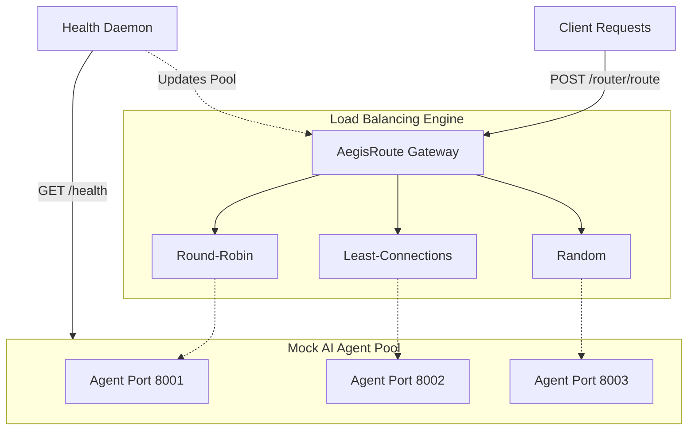

# AegisRoute: Resilient Agent Load Balancing Engine 🛡️

**AegisRoute** is an ultra-fast, auto-healing API Gateway and Load Balancer designed specifically for AI agent fleets. 
It ensures high availability and intelligent traffic distribution across multiple LLM reasoning containers.

## 🌟 Value Proposition
- **Zero-Downtime Failover**: Seamlessly quarantines failing agent nodes and auto-recovers them upon stabilization.
- **Hot-Swappable Load Balancing**: Dynamically shift between Round-Robin, Least-Connections, and Random strategies via query parameters.
- **NOC Terminal Observability**: Live, glowing dark-themed dashboard to monitor cluster health and traffic flattening in real-time.
- **Asynchronous & Lightweight**: Built on Python 3.12 `asyncio` and FastAPI, resulting in minimal overhead.

## 🏗️ System Architecture



## 🧠 Core Logic Snippets

### Round-Robin Strategy
```python
if strategy == "round-robin":
    global round_robin_index
    node = healthy_nodes[round_robin_index % len(healthy_nodes)]
    round_robin_index = (round_robin_index + 1) % len(healthy_nodes)
    return node
```

### Least-Connections Strategy
```python
elif strategy == "least-connections":
    async with active_connections_lock:
        # Sort healthy nodes by active connections
        node = min(healthy_nodes, key=lambda p: active_connections[p])
    return node
```

## 🧪 Try it Out

**1. Ping the Health Check (Public Gateway)**
```bash
curl -X GET <PUBLIC_ROUTER_URL>/api/v1/balancer/stats
```

**2. Send a Query (Round Robin)**
```bash
curl -X POST "<PUBLIC_ROUTER_URL>/router/route?strategy=round-robin" \
     -H "Content-Type: application/json" \
     -d '{"query":"Calculate prime numbers"}'
```

**3. Check the Dashboard**
Navigate to the `<PUBLIC_DASHBOARD_URL>` provided during the pitch to see the glowing NOC Terminal in action!
